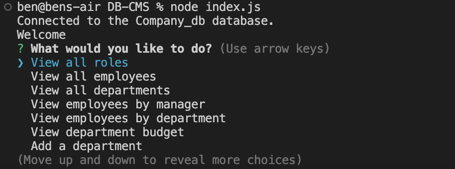

# DB-CMS
database content management system

## Description
This project is creating an database content management system of a company DB by using node.js

## Table of Contents
- [Installation](#installation)
- [Usage](#usage)
- [Credits](#credits)
- [License](#license)
- [Tests](#tests)

## Installation
1. run command: npm install
2. login to mysql server and run the schema.sql & seeds.sql in db folder.
3. add .env file to configure database credential （credential information will be used in index.js line 11-12)

## Usage
1. Go to project directory and run command: node index.js

2. choose an action from the menu

3. The application can view all the data.

4. The application can add new employee/role/department data to database.

5. The application can delete employee/role/department of database.

Please refer to the video demo from below URL:

https://www.youtube.com/watch?v=25yImly3yk4

## Credits

BenLiu104 : https://github.com/BenLiu104

## License

License - MIT

## Tests
run query.sql in db folder to test seeded data.

